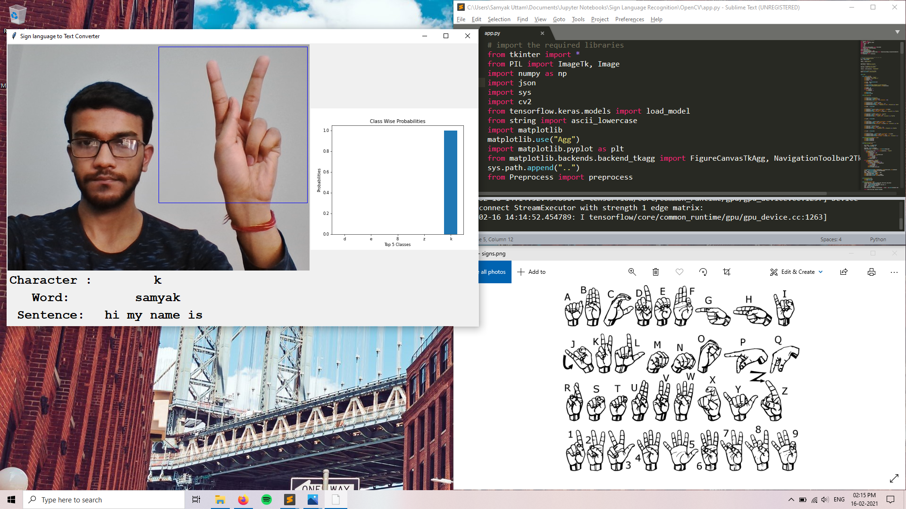

The following is the implementation of live Sign Language Recognition using OpenCV. We have created a graphical interface using tkinter library in python.

## How To Run
1. cd into OpenCV folder using
	```
	cd OpenCV
	```
2. To run the file, type
	```
	python "app.py"
	```

## Output


Below the camera feed, we have three text fields that show the current character, word, and sentence. And on the right of the camera feed, we have a plot that shows the probability of the current character which is being predicted.