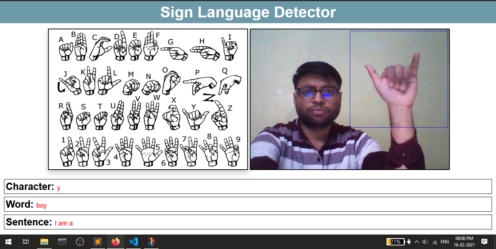

## How it works:

The front end of the webapp is built using HTML, CSS and Vanila JS while backend is built using [Flask](https://flask.palletsprojects.com/en/1.1.x/). Every second the image is captured using the user's webcam is sent to the backend where the machine learning model is loaded and send's the predicted charecter which is then displayed.

## How To Run:

* Step 1: cd into WEBAPP folder by using:  
          
    ```
    cd WebApp
    ```

* Step 2: To run the flask server use:
 
    ```
    python "app.py"
    ```

## Output:



